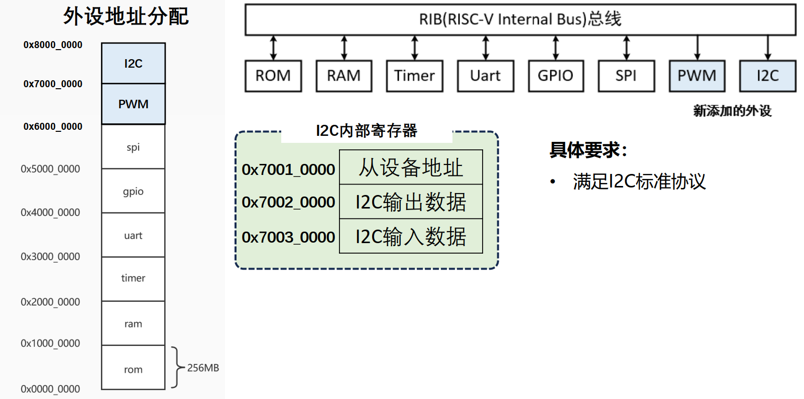
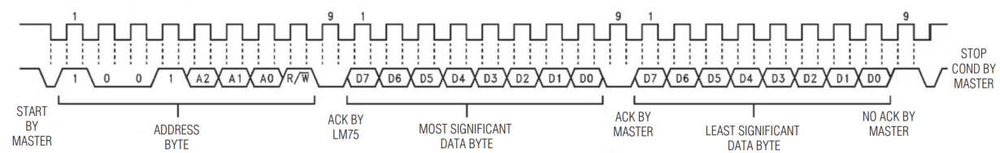
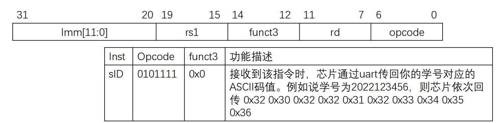
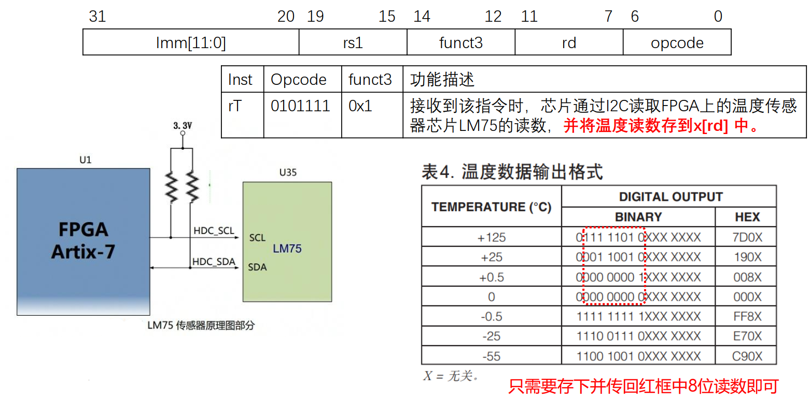
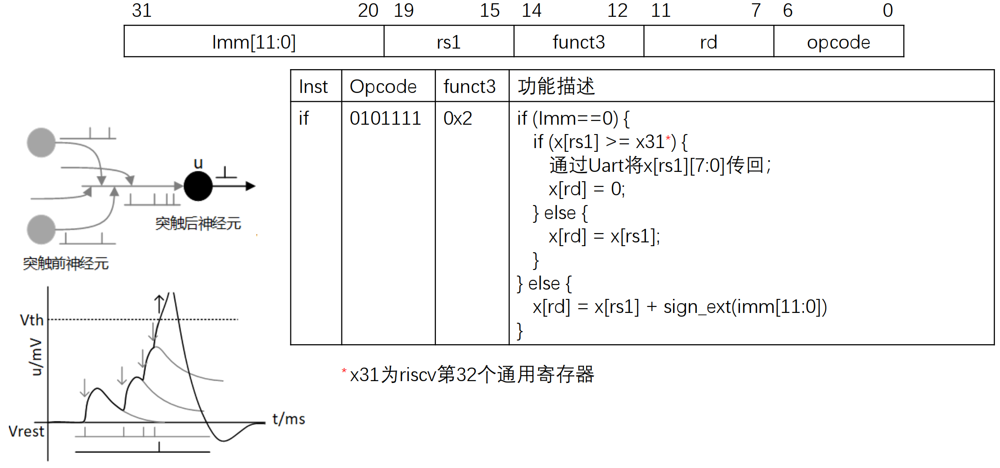

# tinyriscv-modified

## GPIO 的引出
原有的 Tinyriscv 中引出了2个 GPIO, 现在需要将其修改为16个:
- 修改 [gpio.v](./rtl/perips/gpio.v) 中的信号宽度, 为后14个引脚添加写入逻辑
- 在顶层模块 [tinyriscv_soc_top.v](./rtl/soc/tinyriscv_soc_top.v) 中修改 io_in 信号的宽度, 并将gpio模块的所有输入输出引出到 SoC 的 gpio 管脚处

## 资源的删减
原有的 uart_debug 接收的 packet 大小为131，模块内部存在 132d x 8w 的寄存器组. 现需修改为 uart_debug 接收的 packet 大小为35，模块内部存在 35d x 8w 的寄存器组
- 修改 [uart_debug.v](./rtl/debug/uart_debug.v) 中 `rx_data` 的大小; 宏 `UART_FIRST_PACKET_LEN` 和 `UART_REMAIN_PACKET_LEN` 对应的值; 包大小 `fw_file_size` 及对应的 `rx_data` 位数索引也作出相应修改
- 具体配置参数可以参考修改后的软件 [tinyriscv_fw_downloader.py](./tools/tinyriscv_fw_downloader.py)

原有的 ROM 大小为 4096d x 32w，现需修改为 256d x 32w
- 直接修改 [defines.v](./rtl/core/defines.v) 中的定义即可

原有的 RAM 大小为 4096d x 32w，现需修改为 16d x 32w
- 直接修改 [defines.v](./rtl/core/defines.v) 中的定义即可
- 在编译软件时需要修改链接脚本. 如在 [link.lds](./tests/example/link.lds) 中需要修改 MEMORY 关键词中的 ram 大小并调整 stack 大小 `__stack_size`

## PWM 外设的添加

- 在 [rib.v](./rtl/core/rib.v) 中给 rib 总线添加一个 slave interface, 按序号分配为 slave_6, 起始地址映射到 0x6000_0000
- `rtl/utils/` 路径下添加 [gen_pulse.v](./rtl/utils/gen_pulse.v) 模块, 实现脉冲生成; `rtl/perips/` 中添加 [pwm.v](./rtl/perips/pwm.v) 外设, 完成寄存器定义, 读写寄存器, 例化 gen_pulse 模块
- 顶层模块中添加总线子模块接口, 例化 pwm 模块, 引出 io
- 为 [compile_rtl.py](./sim/compile_rtl.py) 添加对应 `.v` 文件
- 编写软件库 [pwm.h](./tests/example/include/pwm.h), 定义寄存器地址和读写宏

## I2C 外设的添加

- I2C protocol 整理: [i2c.md](./doc/i2c.md)
- `rtl/perips/` 路径下添加 [i2c.v](./rtl/perips/i2c.v), 实现了 iic 的读功能, 默认的读取地址是 ALINX AX7035 中的 LM75 温度传感器地址 8'b10010001, 实现的功能是当 iic_en 寄存器被写入 32'h1 时, 将 iic_device_addr 处的温度寄存器值读取到 iic_read_data 的低16位, 读取 LM75 温度寄存器的时序如下:

- 添加了一个分频系数配置寄存器, 用于配置需要的 scl 时钟
- 在 [rib.v](./rtl/core/rib.v) 中给 rib 总线添加一个 slave interface, 按序号分配为 slave_7, 起始地址映射到 0x7000_0000
- 顶层模块中添加总线子模块接口, 例化 i2c 模块, 引出 io
- 为 [compile_rtl.py](./sim/compile_rtl.py) 添加对应 `.v` 文件
- 编写软件库 [i2c.h](./tests/example/include/i2c.h), 定义寄存器地址和读写宏

## 拓展指令: Send ID

- 修改 [uart.v](./rtl/perips/uart.v) 的写寄存器逻辑 (相当于添加了一个状态机器), 当寄存器 uart_ctrl[2] 和 uart_ctrl[0] 都被写入 1 时, 触发一次输出学号, 通过 uart 输出一次学号. 在此基础上该指令的运行过程简化为一次访存: 在地址 0x30000000 处写入一次 0x00000005
- 在 [defines.v](./rtl/core/defines.v) 中添加拓展指令类型 `INST_TYPE_EXT`; 为 [id.v](./rtl/core/id.v) 与 [ex.v](./rtl/core/ex.v) 模块添加对 sID 指令的支持

## 拓展指令: Read Temperature

- 指令功能可以等效为一次访存, 但由于 i2c 读取温度读数有延迟, 需要为 i2c 的访问增加握手信号: 在 [ex.v](./rtl/core/ex.v) 中运行该指令会向外设发送 req 信号, 等待过程中暂停流水线; ack 到达握手成功后重启流水线
- 由于 tinyriscv 原来的实现中暂停流水线使用的 hold 信号会默认产生气泡, 造成指令丢失, 因此修改了流水线寄存器 [pc_reg.v](./rtl/core/pc_reg.v), [if_id.v](./rtl/core/if_id.v) 和 [id_ex.v](./rtl/core/id_ex.v), 当检测到 i2c 暂停流水线后执行模块会给出 stall 信号使流水线寄存器均保持当前的值
- 修改 [i2c.v](./rtl/perips/i2c.v), 读取完成后将数据右移7位, 满足读取要求
- 为新指令添加 opcode 与 funct3 的宏, 方便译码

## 拓展指令: Integrated & Fire

- 直接在驿码和执行模块添加指令对应操作即可 (x_rs1 和 x_31 的比较采用有符号数比较)

## 静态分支预测
- 添加了静态分支预测, 采用的方法是 BTFN 预测, 即对于向后的跳转预测为跳, 向前的跳转则预测为不跳. 向后的跳转是指跳转的目标地. 依据是在实际的汇编程序中向后分支跳转的情形要多于向前跳转的情形, 譬如常见的 for 循环生成的汇编指令往往使用向后跳转的分支指令; 对于 jal 指令, 提前译码消除了流水线气泡
- 提前译码模块见 [pre_id.v](./rtl/core/pre_id.v), 分支预测策略见 [bpu.v](./rtl/core/bpu.v)
- 对于 simple 测试用例, 原用时 57770ns, 添加分支预测后用时 51610ns, 效率提高了 10.66%; 且分支预测逻辑较为简单, 在取指模块中也不会影响关键路经, 目测不会对整体时钟频率造成影响

## 参考资料
- tinyriscv: [liangkangnan/tinyriscv](https://gitee.com/liangkangnan/tinyriscv)
- 分支预测参考: [e203_hbirdv2](https://github.com/riscv-mcu/e203_hbirdv2)
- I2C 协议手册: [UM10204.pdf](https://www.nxp.com/docs/en/user-guide/UM10204.pdf)