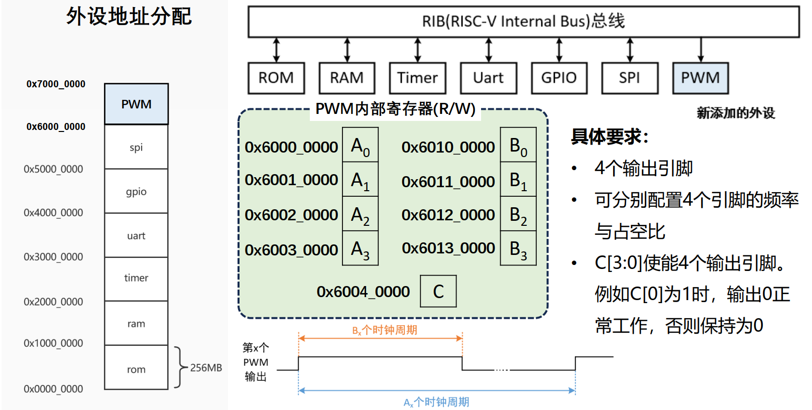

# tinyriscv-modified

## GPIO 的引出
原有的 Tinyriscv 中引出了2个 GPIO, 现在需要将其修改为16个:
- 修改 [gpio.v](./rtl/perips/gpio.v) 中的信号宽度, 为后14个引脚添加写入逻辑
- 在顶层模块 [tinyriscv_soc_top.v](./rtl/soc/tinyriscv_soc_top.v) 中修改 io_in 信号的宽度, 并将gpio模块的所有输入输出引出到 SoC 的 gpio 管脚处
- 验证程序见 [main.c](./tests/example/gpio_16/main.c), 在 `sim/` 路径下运行 `python ./sim_new_nowave.py ../tests/example/gpio_16/gpio.bin inst.data` , 之后查看波形

## 资源的删减
原有的 uart_debug 接收的 packet 大小为131，模块内部存在 132d x 8w 的寄存器组. 现需修改为 uart_debug 接收的 packet 大小为35，模块内部存在 35d x 8w 的寄存器组
- 修改 [uart_debug.v](./rtl/debug/uart_debug.v) 中 `rx_data` 的大小; 宏 `UART_FIRST_PACKET_LEN` 和 `UART_REMAIN_PACKET_LEN` 对应的值; 包大小 `fw_file_size` 对应的 `rx_data` 位数索引
- 具体配置参数可以参考修改后的软件 [new_tinyriscv_fw_downloader.py](./tools/new_tinyriscv_fw_downloader.py)

原有的 ROM 大小为 4096d x 32w，现需修改为 256d x 32w
- 直接修改 [defines.v](./rtl/core/defines.v) 中的定义即可

原有的 RAM 大小为 4096d x 32w，现需修改为 16d x 32w
- 直接修改 [defines.v](./rtl/core/defines.v) 中的定义即可
- 在编译软件时需要修改链接脚本. 如在 [link.lds](./tests/example/link.lds) 中需要修改 MEMORY 关键词中的 ram 大小并调整 stack 大小 `__stack_size`

其他说明
- 添加了脚本文件 [sim_data_file.py](./sim/sim_data_file.py), 在 `sim/` 目录下可以使用如下命令指定转换好的 `xxx.data` 文件作为测试向量: `python sim_data_file.py path_of_the_target_mem_file.data inst.data`

## PWM 外设的添加
按如下要求添加 PWM 外设:

- 在 [rib.v](./rtl/core/rib.v) 中给 rib 总线添加一个 slave interface, 按序号分配为 slave_6, 起始地址映射到 0x6000_0000

## 参考资料
- 原项目地址: [liangkangnan/tinyriscv](https://gitee.com/liangkangnan/tinyriscv)