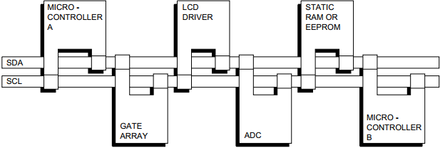
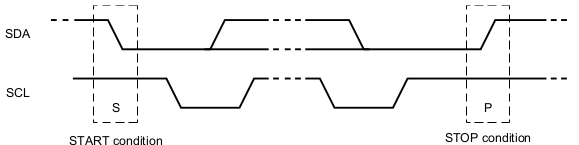
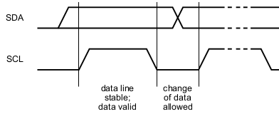
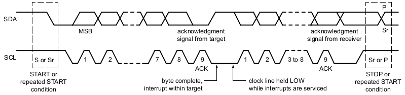

# I2C protocol

## 概述
I2C (Inter-Integrated Circuit, IIC) 是一种串行通信协议, 属于半双工同步传输类型总线, 可以有多个主设备 (master) 和从设备 (slave). IIC 1982 年由 Philips 公司开发

## 接口
主设备与从设备之间使用两条线进行通信, 都是双向信号并通过电阻上拉:
- 串行数据线 SDA (Serial Data Line)
- 串行时钟线 SCL (Serial Clock Line)

有两个微处理器的I2C配置示例:

## 框图
最小配置: (Single controller)
- START condition
- STOP condition
- Acknowledge
- 7-bit target address

## 工作流程与时序
### 空闲状态
总线空闲时, SDA 和 SCL 被所接的上拉电阻拉高，保持着高电平

### 起始与结束条件
所有总线事务以 START 开始, 以 STOP 结束:
- 当 SCL 为 HIGH 时, SDA 线上的信号拉低表示开始传输 (START condition)
- 当 SCL 为 HIGH 时，SDA 线上信号拉高表示结束传输 (STOP condition)

### 数据有效性
SDA 线上的数据必须在时钟的 HIGH 周期内保持稳定; 只有当 SCL 线上的时钟信号为 LOW 时, 数据线的状态才能改变. 即为传输的每个数据位生成一个时钟脉冲, 如下所示:

### 数据格式

## 时钟与通信速率
IIC 协议的时钟频率是可以根据具体应用和设备支持的情况进行调节, 支持的速率如下: 

| 模式 | 速率 |
|:-------|:--------|
|标准模式（Standard Mode）|100kb/s|
|快速模式（Fast Mode）|400kb/s|
|增强快速模式（Fast Mode Plus）|1Mb/s|
|高速模式（High Speed Mode）|3.4Mb/s|
|极速模式（Ultra-FastMode）|5Mb/s|
